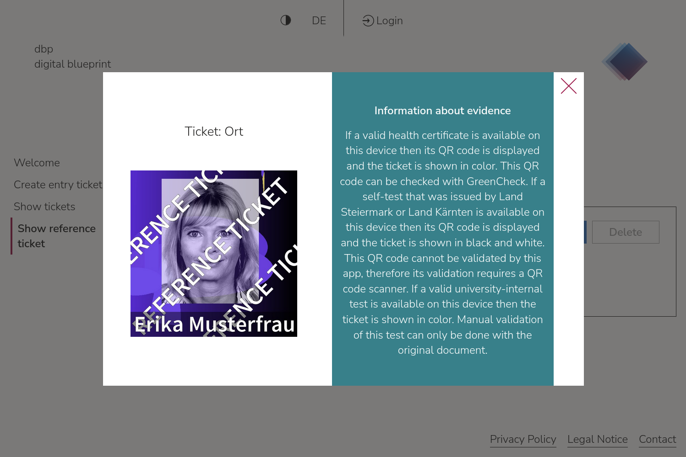

# Greenlight Application

[GitHub Repository](https://github.com/digital-blueprint/greenlight-app) |
[npmjs package](https://www.npmjs.com/package/@digital-blueprint/greenlight-app) |
[Unpkg CDN](https://unpkg.com/browse/@digital-blueprint/greenlight-app/) |
[Greenlight Bundle](https://gitlab.tugraz.at/dbp/greenlight/dbp-relay-greenlight-bundle) |
[Project documentation](https://dbp-demo.tugraz.at/site/software/greenlight.html)

[](https://github.com/digital-blueprint/greenlight-app/actions/workflows/build-test-publish.yml)

Creates an entrance ticket and imports your evidence of a low epidemiological risk on the working device to validate it for admission even before attending a course or exam.
The ticket then enables you to access the university premises quickly and efficiently.



## Prerequisites

- You need the [API server](https://gitlab.tugraz.at/dbp/relay/dbp-relay-server-template) running
- You need the [DbpRelayGreenlightBundle](https://gitlab.tugraz.at/dbp/greenlight/dbp-relay-greenlight-bundle) to create permits for the Covid19 certificate evaluation process
- For more information please visit the [Greenlight project documentation](https://dbp-demo.tugraz.at/site/software/greenlight.html)

## Local development

```bash
# get the source
git clone git@github.com:digital-blueprint/greenlight-frontend.git
cd greenlight
git submodule update --init

# install dependencies
npm install

# constantly build dist/bundle.js and run a local web-server on port 8001 
npm run watch

# constantly build dist/bundle.js and run a local web-server on port 8001 using a custom assets directory assets_custom/
npm run watch-custom

# run tests
npm test
```

Jump to <https://localhost:8001>, and you should get a Single Sign On login page.

To enable building with custom assets, you need to provide your custom assets in the directory `assets_custom/greenlight-app/assets/`. If you want to, you can also change this path in the file `rollup.config.js`. For more information, please visit the [dbp handbook page on custom assets](https://handbook.digital-blueprint.org/frameworks/frontend/dev/assets/#custom-assets).

## Using this app as pre-built package

### Install app

If you want to install the dbp greenlight app in a new folder `greenlight-app` you can call:

```bash
npx @digital-blueprint/cli@latest install-app greenlight greenlight-app /
```

**Warning:** There may be issues when you run these commands as root user, best use a non-root user, like `www-data`.
To do this you can for example open a shell with `runuser -u www-data -- bash`.

Afterwards you can point your Apache web-server to `greenlight-app/public`.

Make sure you are allowing `.htaccess` files in your Apache configuration.

Also make sure to add all of your resources you are using (like your API and Keycloak servers) to the
`Content-Security-Policy` in your `greenlight-app/public/.htaccess`, so the browser allows access to those sites.

You can also use this app directly from the [Unpkg CDN](https://unpkg.com/browse/@digital-blueprint/greenlight-app/)
for example like this: [dbp-greenlight/index.html](https://github.com/digital-blueprint/greenlight-app/tree/main/examples/dbp-greenlight/index.html)

Note that you will need a Keycloak server along with a client id for the domain you are running this html on.

### Update app

If you want to update the dbp greenlight app in the current folder you can call:

```bash
npx @digital-blueprint/cli@latest update-app greenlight
```

**Warning:** After the update the trust data has to be restored, see below.

**Warning:** There may be issues when you run these commands as root user, best use a non-root user, like `www-data`.
To do this you can for example open a shell with `runuser -u www-data -- bash`.

## Cron job for Updating the Trust Data

The app depends on the official trust list, value sets and business rules which
are provided via
https://github.com/Federal-Ministry-of-Health-AT/green-pass-overview

In addition it depends on a set of business rules which are maintained at
https://github.com/digital-blueprint/dcc-at-rule-sets

Both data sets need to be updated regularly via a cron job.

```
0    *    *    *    *     /<my-path>/greenlight-app/public/app/update.sh TUGRAZ
```

The first argument passed to update.sh defines the rule set which should be
downloaded. The script depends on `curl` being installed.

You will find the certificates downloaded in `/<my-path>/greenlight-app/public/app/local/@digital-blueprint/greenlight-app/dgc-trust/prod`.

NOTE: Failing to update the data will result in signatures expiring after 2 days
which breaks the core functionality of the app.

## Activities

This app has the following activities:
- `dbp-acquire-3g-ticket`
- `dbp-show-active-tickets`
- `dbp-show-reference-ticket`

You can find the documentation of these activities in the [greenlight activities documentation](https://github.com/digital-blueprint/greenlight-app/tree/main/src).

## Adapt app

### Functionality

You can add multiple attributes to the `<dbp-greenlight>` tag.

| attribute name | value | Link to description |
|----------------|-------| ------------|
| `provider-root` | Boolean | [app-shell](https://gitlab.tugraz.at/dbp/web-components/toolkit/-/tree/master/packages/app-shell#attributes) |
| `lang`         | String | [language-select](https://gitlab.tugraz.at/dbp/web-components/toolkit/-/tree/master/packages/language-select#attributes) | 
| `entry-point-url` | String | [app-shell](https://gitlab.tugraz.at/dbp/web-components/toolkit/-/tree/master/packages/app-shell#attributes) |
| `keycloak-config` | Object | [app-shell](https://gitlab.tugraz.at/dbp/web-components/toolkit/-/tree/master/packages/app-shell#attributes) |
| `base-path` | String | [app-shell](https://gitlab.tugraz.at/dbp/web-components/toolkit/-/tree/master/packages/app-shell#attributes) |
| `src` | String | [app-shell](https://gitlab.tugraz.at/dbp/web-components/toolkit/-/tree/master/packages/app-shell#attributes) |
| `html-overrides` | String | [common](https://gitlab.tugraz.at/dbp/web-components/toolkit/-/tree/master/packages/common#overriding-slots-in-nested-web-components) |
| `themes` | Array | [theme-switcher](https://gitlab.tugraz.at/dbp/web-components/toolkit/-/tree/master/packages/theme-switcher#themes-attribute) |
| `darkModeThemeOverride` | String | [theme-switcher](https://gitlab.tugraz.at/dbp/web-components/toolkit/-/tree/master/packages/theme-switcher#themes-attribute) |
| `gp-search-hash-string` | String | [greenlight activities](https://github.com/digital-blueprint/greenlight-app/tree/main/src) |
| `gp-search-self-test-string-array` | String | [greenlight activities](https://github.com/digital-blueprint/greenlight-app/tree/main/src) |
| `gp-self-test-valid` | Boolean | [greenlight activities](https://github.com/digital-blueprint/greenlight-app/tree/main/src) |
| `ticket-types` | Object | [greenlight activities](https://github.com/digital-blueprint/greenlight-app/tree/main/src#shared-attributes) |
| `show-preselected` | Boolean | [greenlight activities](https://github.com/digital-blueprint/greenlight-app/tree/main/src) |
| `preselected-option` | String | [greenlight activities](https://github.com/digital-blueprint/greenlight-app/tree/main/src) |
| `file-handling-enabled-targets` | String | [file-handling](https://gitlab.tugraz.at/dbp/web-components/toolkit/-/tree/master/packages/file-handling#attributes) |
| `nextcloud-web-app-password-url` | String | [file-handling](https://gitlab.tugraz.at/dbp/web-components/toolkit/-/tree/master/packages/file-handling#attributes) |
| `nextcloud-web-dav-url` | String | [file-handling](https://gitlab.tugraz.at/dbp/web-components/toolkit/-/tree/master/packages/file-handling#attributes) |
| `nextcloud-file-url` | String | [file-handling](https://gitlab.tugraz.at/dbp/web-components/toolkit/-/tree/master/packages/file-handling#attributes) |
| `nextcloud-auth-info` | String | [file-handling](https://gitlab.tugraz.at/dbp/web-components/toolkit/-/tree/master/packages/file-handling#attributes) |
| `nextcloud-name` | String | [file-handling](https://gitlab.tugraz.at/dbp/web-components/toolkit/-/tree/master/packages/file-handling#attributes) |

#### Mandatory attributes

If you are not using the `provider-root` attribute to "terminate" all provider attributes
you need to manually add these attributes so that the topic will work properly:

```html
<dbp-greenlight
    auth
    requested-login-status
    analytics-event
>
</dbp-greenlight>
```

### Design

For frontend design customizations, such as logo, colors, font, favicon, and more, take a look at the [theming documentation](https://dbp-demo.tugraz.at/dev-guide/frontend/theming/).

## "dbp-greenlight" slots

These are common slots for the app-shell. You can find the documentation of these slots in the [app-shell documentation](https://gitlab.tugraz.at/dbp/web-components/toolkit/-/tree/master/packages/app-shell).
For the app specific slots take a look at the [greenlight activities](https://github.com/digital-blueprint/greenlight-app/tree/main/src).

